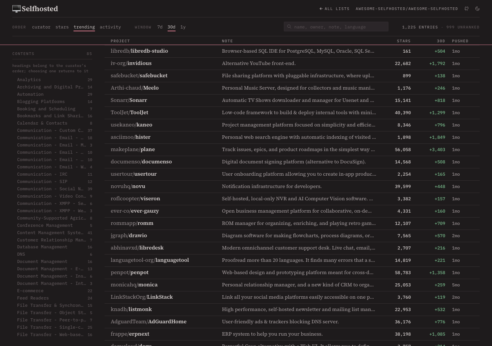
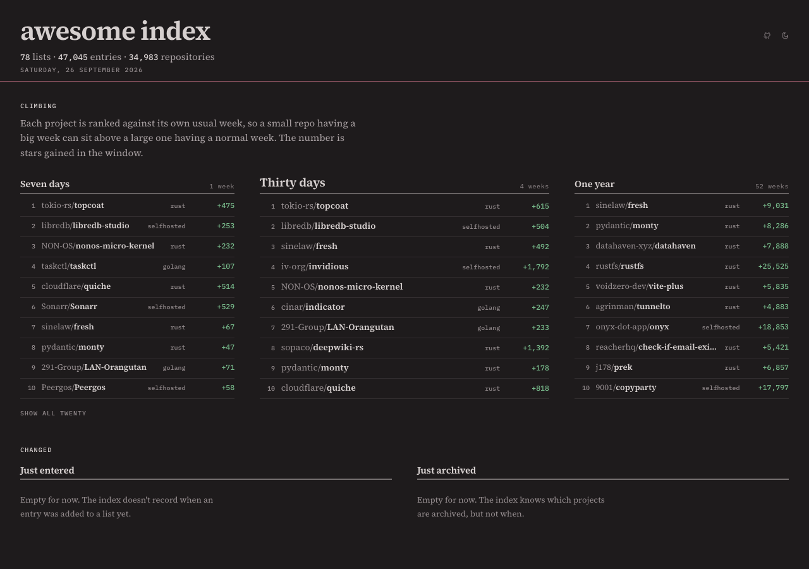

# awesome index

**[awesome.donld.me](https://awesome.donld.me)**: awesome lists you can reorder.



Awesome lists are long, and the order they are written in tells you nothing
about what is alive. This crawls them into a local sqlite dataset, follows every
entry to GitHub, keeps fourteen months of weekly star history, and lets you sort
by the curator's order, stars, recent pushes, or **climbing**: stars gained
measured against the repository's own usual week, so a small repo having a big
week sits above a large one having a normal one.



## What it knows

- Every entry of every list, and which of them are GitHub repositories. The
  counts are on the front page, taken from the shards themselves.
- The rest (sites, papers, videos, registries, books) carry no popularity
  signal, so they keep the curator's order.
- Weekly star history per repository, behind the 7-day, 30-day and 1-year
  numbers. The history stays in the dataset; the pages carry only the counts.
- An activity label (active, slow, stalled, archived), computed as a percentile
  **inside each language's cohort**, because eighteen months without a commit
  means abandonment for a TypeScript package and completion for a C library. On
  this corpus the oldest quartile starts at about 200 days for TypeScript and
  about 3,100 for Objective-C.

The score behind the climbing order is never shown.

## How it is put together

Nuxt, generated statically, no server. Each list is one JSON shard small enough
to ship whole, so the browser holds the whole list and reordering it is a
`.sort()` instead of four thousand pre-rendered pages.

```
bin/crawl.ts      read the list READMEs, resolve every entry, refresh GitHub metadata
bin/history.ts    weekly star history, by numeric repo id so renames do not split it
bin/popularity.ts rank the targets that have no stars of their own
bin/shards.ts     build public/data/*.json from the dataset
bin/fixtures.ts   a shard to develop against without a dataset
```

The dataset is sqlite, kept out of git and carried between CI runs as a release
asset. A nightly Action crawls, takes one slice of star history, republishes the
dataset, rebuilds the shards and deploys.

## Running it

```
pnpm install
pnpm dev                  # runs against fixtures/ if there is no dataset
```

With a dataset (`GITHUB_TOKEN` needs no scopes; it only reads public data):

```
pnpm crawl --help
pnpm history --help       # --concurrency=8 for a backfill by hand
pnpm shards
pnpm generate
```

`pnpm test` · `pnpm typecheck` · `pnpm format`

## Credits

The lists belong to their curators; this only reads them. Star history comes
from GitHub's `/stargazers/history` endpoint, and the full curve behind an
expanded row is drawn by [star-history.com](https://star-history.com). Icons are
[Pixelarticons](https://github.com/halfmage/pixelarticons) by Gerrit Halfmann.
Type is Source Serif 4 and IBM Plex Mono.

Made with ♥ by [Donald](https://donld.me) and Opus. MIT.
